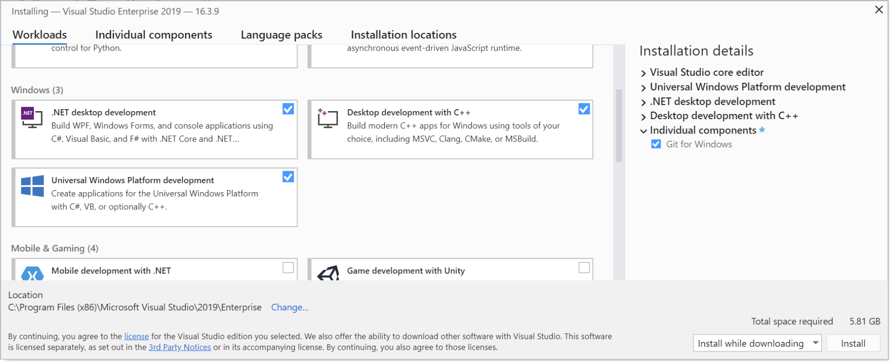

# Установка Rust

### `Установка Visual C++ Build-Tools (Windows)`
Для того, чтобы начать работать с Rust на Windows надо установить пакет инструментов `Visual Build Tools C++`, и там выбрать 3 компонента: разработка `C++`, разработка `.NET` и разработка `UWP`.

Возможно, в данный момент вам не потребуются все 3 пакета, но лучше их установить.

Rust по умолчанию работает с Git, поэтому также отдельно можно либо выбрать компонент `Git для Windows`, либо установить Git отдельно.


### `Установка Rust`
Теперь мы готовы установить Rust. Для этого достаточно перейти на [официальный сайт Rust](https://www.rust-lang.org/tools/install).

После установки Rust, чтобы проверить его наличие введиет в консоль `cargo --version`, если отобразится номер версии, это подтверждает, что Rust установлен правильно.

### `Установка редактора`
Для Rust я могу выделить 3 адекватных редактора:
  - Clion от Jetbrains
  - VsCode от Microsoft (или открытый VsCodium)
  - Vim

Мой выбор пал на VsCode, поэтому и настраивать будем его.
Для Rust нам понадобится установить ряд расширений:
  - `Rust` официальный инструментарий от разработчков языка
  - `rust-analyzer` (альтернатива Rust, эти два расширения конфликтуют)
  - `CodeLLDB` (дебаггер для Rust и C++)

### `Пакетный менеджер`
В Rust используется пакетный менеджер `Cargo`. Ниже я приведу ряд полезных команд для разработки.
```
cargo new project_name --bin - данная команда создает новый проект. Проекты стоит называть маленькими буквами, а слова делить _.
cargo check - проверяет работоспособность проекта без его запуска.
cargo build - собирает проект в исполняемый файл.
cargo run - запускает проект.
```